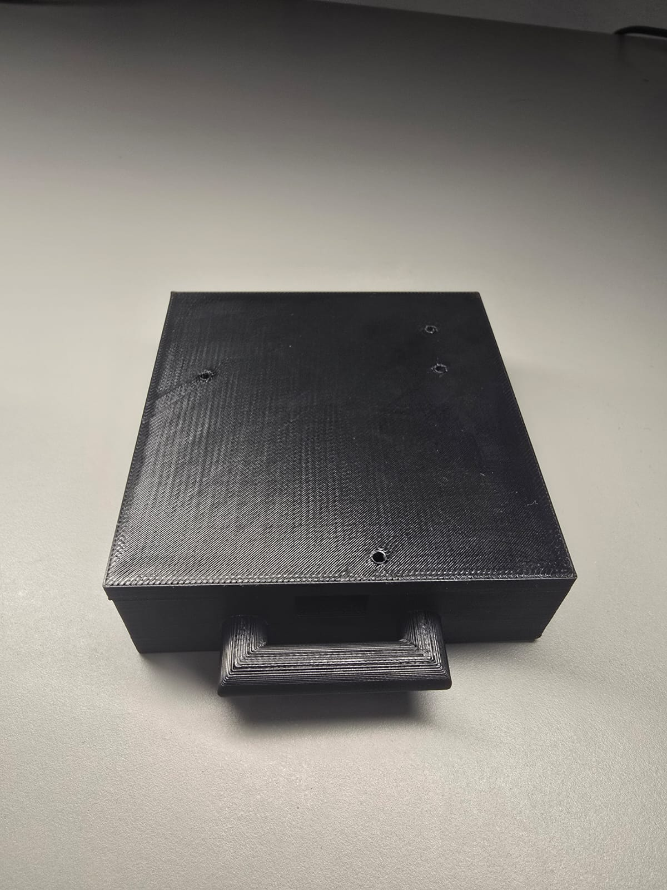
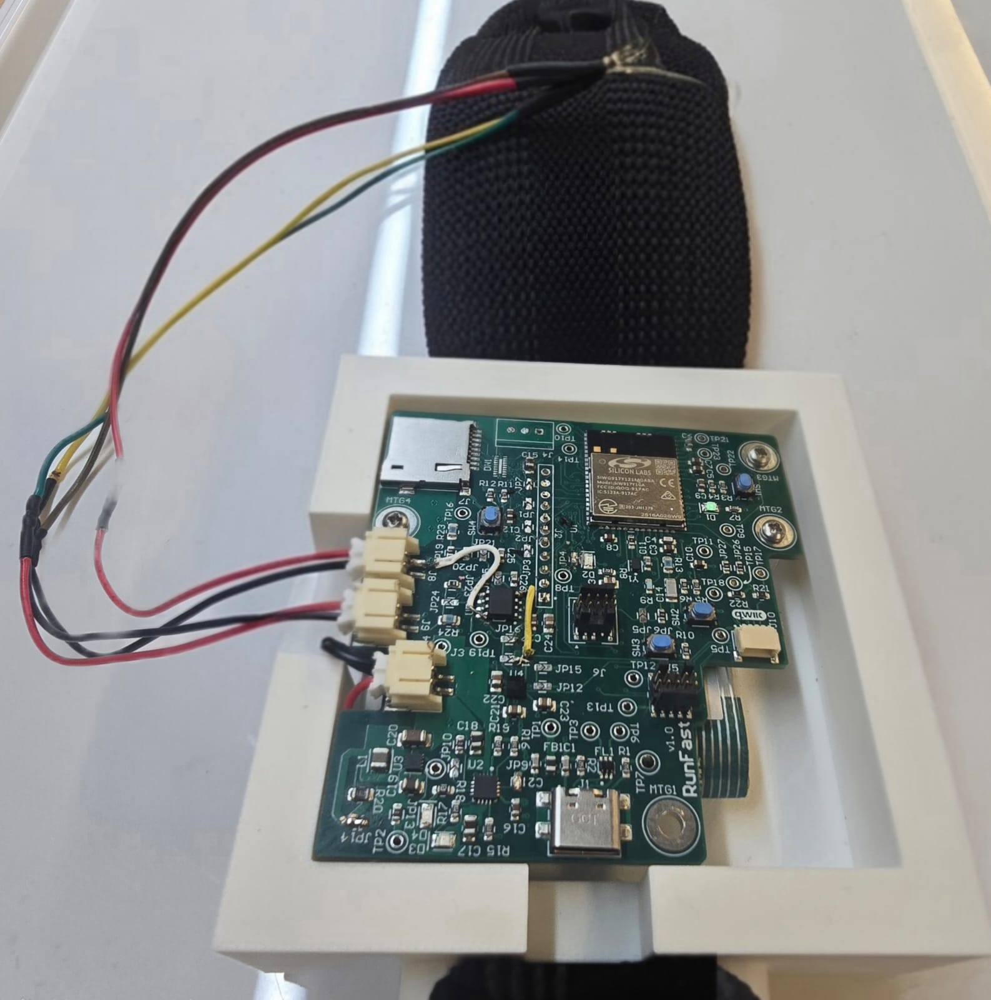
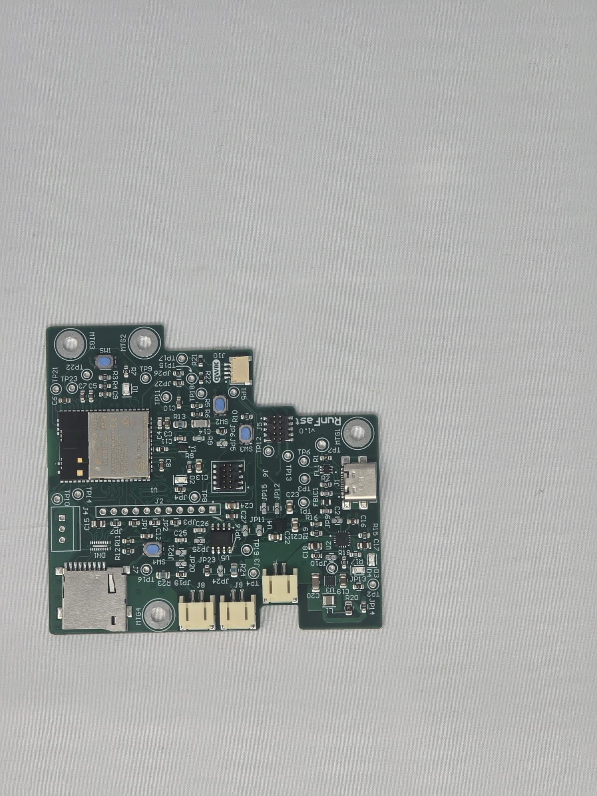
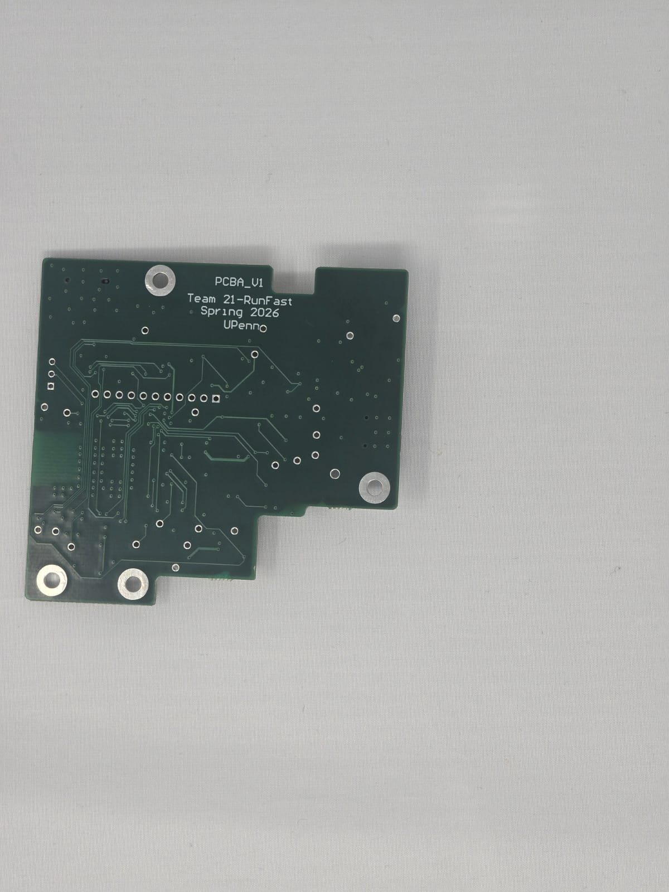
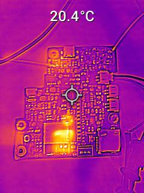
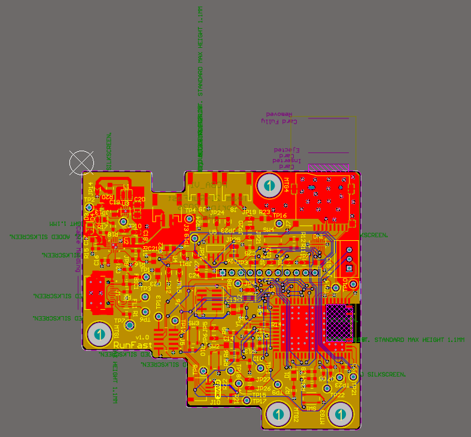
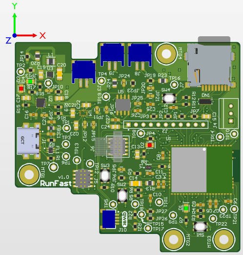
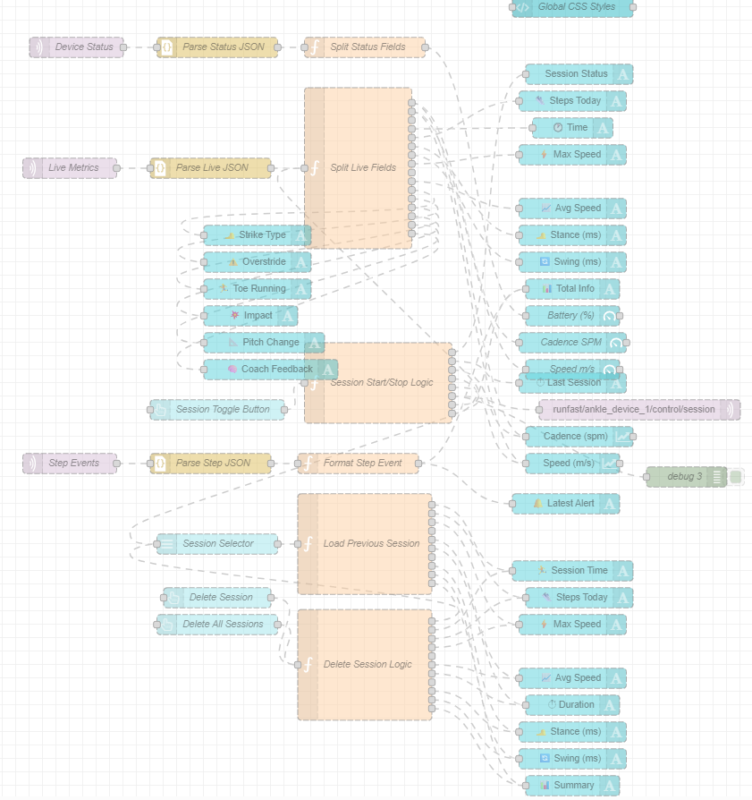
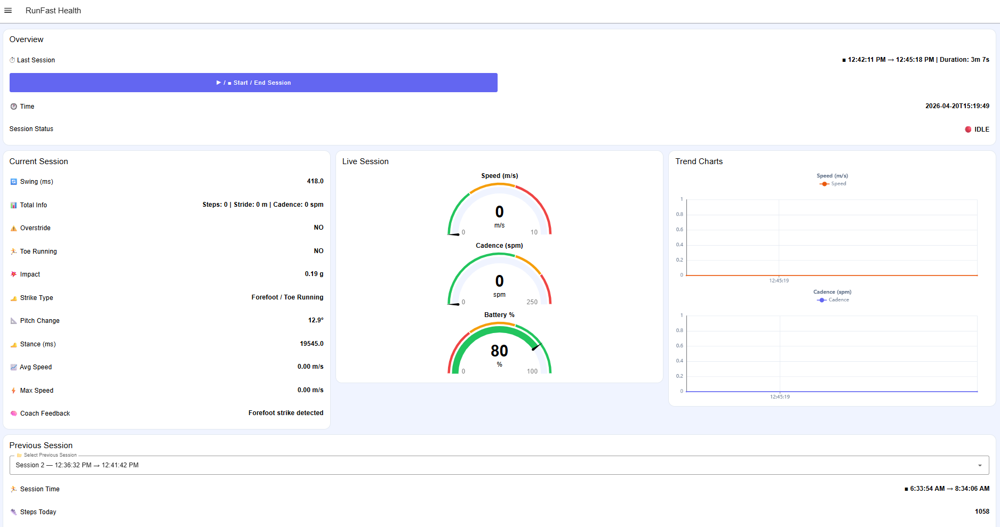
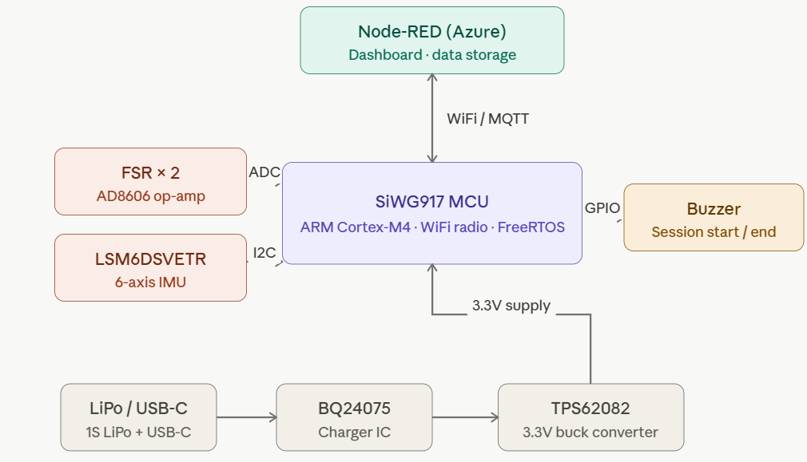

# A011G-Final-Submission

**Team Number: 21**

**Team Name: RunFast**

| Team Member Name | Email Address           | GitHub Username |
| ---------------- | ----------------------- | --------------- |
| Muhammad Noman   | noman178@seas.upenn.edu | nomanawan178    |
| Deepa Lokesha    | deepasr1@seas.upenn.edu | DeepaLokesha    |

**GitHub Repository URL: https://github.com/ese5160/a11g-final-submission-s26-s26-t21-runfast.git**

## 1. Video Presentation

Here is [link ](https://youtu.be/V0zoCW-BwbQ)to the YouTube video but we are also adding Google Drive [Link](https://drive.google.com/file/d/1zSXKc-NsW7YwXJPD1rIJcj87u5jR18MJ/view?usp=drive_link) as a backup.

## 2. Project Summary

##### Device Description

RunFast is an ankle-mounted IoT wearable that captures real-time biomechanical data using Force Sensitive Resistors (FSRs) and a 6-axis IMU to help runners monitor and improve their running form. The wearable performs edge-based stride analysis and streams live metrics to a cloud dashboard over WiFi for visualization, logging, and future coaching insights.

Most fitness trackers only report high-level statistics such as pace or distance, but they cannot detect subtle biomechanical issues that often lead to injury. RunFast was inspired by the idea of giving runners real-time access to stride-level feedback, enabling them to identify inefficient running patterns without needing a coach or expensive lab equipment.

The device uses the internet through WiFi connectivity provided by the SiWG917 SoC. Sensor data and computed metrics are transmitted using MQTT to a cloud-hosted Node-RED dashboard on Microsoft Azure, enabling live monitoring, session logging, and over-the-air firmware updates (OTAFU).

##### Device Functionality

RunFast is built around the Silicon Labs SiWG917 wireless MCU, which integrates an ARM Cortex-M4 processor and WiFi connectivity into a single module. Two FSR sensors placed under the foot measure pressure distribution during heel and toe contact, while the LSM6DSVETR IMU captures acceleration and angular velocity data to estimate cadence, stance time, swing time, and stride smoothness.

The FSR outputs are conditioned using an AD8606 dual op-amp circuit and sampled through the MCU ADC channels. The IMU communicates with the MCU over I2C. Processed metrics are transmitted over WiFi via MQTT to a Node-RED dashboard hosted on Microsoft Azure for live visualization and logging. A buzzer provides immediate user feedback by signaling session start and end events. The system is powered by a LiPo battery with charging and power regulation handled by the BQ24075 charger IC and TPS62082 buck converter.

##### Challenges

One of the biggest hardware challenges occurred during PCB bring-up, where the VCC and GND pins of the op-amp were accidentally swapped during layout. It took us a while to figure out why the board was consuming a lot of current. We identified the issue during testing and fixed it by cutting the affected traces and adding jumper wires, allowing the board to function correctly without requiring a full redesign.

On the firmware side, the Silicon Labs SiWG917 ecosystem and toolchain were completely new to us. Initial WiFi, MQTT, and peripheral bring-up took significant debugging effort, especially when integrating multiple peripherals together. We solved this by validating each subsystem independently before combining them into the final firmware architecture.

Another challenge was mechanical stability. Since the device is ankle-mounted, slight movement of the wearable changed the sensor orientation and affected IMU consistency. We improved this by redesigning the mounting method and experimenting with better strap tension and enclosure positioning.

##### Prototype Learnings

The prototype taught us that physical integration is just as important as the electronics and firmware. Small mechanical shifts in sensor placement significantly impacted measurement consistency, especially for motion tracking and pressure sensing.

We also learned the importance of modular firmware design. Separating sensing, processing, wireless communication, and dashboard functionality into independent modules made debugging and system integration much easier.

If we rebuilt the device, we would redesign the enclosure around measured hardware dimensions from the start and use a stiffer, lower-profile mounting system. We would also likely move toward a shoe-mounted architecture to place sensing closer to the ground-contact point and improve pressure measurement reliability.

##### Next Steps & Takeaways

The next major step is validating the analog front-end and stride-detection algorithms during longer outdoor running sessions. Future improvements include refining biomechanical classification algorithms, improving enclosure durability, integrating haptic feedback, and expanding the dashboard with long-term analytics and coaching recommendations.

Through ESE5160, we gained hands-on experience designing a complete IoT system from the ground up: including PCB design, embedded firmware, wireless communication, cloud integration, debugging, and prototype iteration. The course demonstrated how real-world engineering involves not only building successful features, but also diagnosing failures, redesigning hardware, and integrating multiple subsystems into one reliable product.

##### Project Links:

Here is [link ](http://20.3.209.83:1880/dashboard/runfast-health)to our Node-Red dasboard:

Here is [link ](https://upenn-eselabs.365.altium.com/designs/E674709C-F42F-489D-AAC5-CFB0C3BB367B#design)to the final Altium project.

## 3. Hardware & Software Requirements

## Hardware Requirements Specification (HRS)

| ID    | Requirement                                                                                                                            |
| ----- | -------------------------------------------------------------------------------------------------------------------------------------- |
| HRS01 | The system shall consist of an ankle-mounted wearable module, worn on the leg.                                                         |
| HRS02 | The module shall be based on the SIWG917Y121MGABA MCU.                                                                                 |
| HRS03 | The module shall include at least one IMU to measure leg motion during running.                                                        |
| HRS04 | The module shall include pressure sensors positioned to detect foot-ground contact events and loading characteristics.                 |
| HRS05 | The pressure sensors shall be capable of detecting foot contact onset and release to enable measurement of stance and swing phases.    |
| HRS06 | The module shall include a buzzer to indicate system status, including session start and end.                                          |
| HRS07 | The system shall include a single-cell Li-ion battery (3.7V nominal) as the primary power source.                                      |
| HRS08 | The system shall include appropriate voltage regulation circuitry to supply stable operating voltages to the MCU, sensors, and buzzer. |

## Software Requirements Specification (SRS)

| ID    | Requirement                                                                                                                                             |
| ----- | ------------------------------------------------------------------------------------------------------------------------------------------------------- |
| SRS01 | The system shall sample pressure sensor data at a sufficient rate to reliably detect foot contact start and end events.                                 |
| SRS02 | The system shall segment each stride into stance and swing phases using pressure sensor data.                                                           |
| SRS03 | The system shall compute ground contact time (GCT) for each stride with a timing resolution of at least 10 ms.                                          |
| SRS04 | The system shall compute cadence in real time based on consecutive foot contact events.                                                                 |
| SRS05 | The system shall use IMU data to estimate leg swing timing, peak motion intensity, and motion smoothness during the swing phase.                        |
| SRS06 | The system shall activate the buzzer to signal session start and session end events.                                                                    |
| SRS07 | The system shall enter a low-power sleep state when no motion is detected for more than 5 minutes.                                                      |
| SRS08 | All real-time sensing, stride analysis, and feedback generation shall execute locally on the device without requiring continuous internet connectivity. |
| SRS09 | The system shall transmit summary performance metrics to a remote dashboard via Wi-Fi for visualization and logging.                                    |

## 4. Project Photos & Screenshots

</img> 
</img> 
</img> 
</img> 
</img> 
</img>

</img> 
</img> 
</img>
</img>

## 5. Codebase

Do *not* commit any of your source code to this repository. Rather, provide links to the other GitHub repository you've already been using with your firmware.

- A link to your final embedded C firmware codebases
  Here is [link ](https://github.com/ese5160/final-project-firmware-s26-t21-runfast-3)to our final firmware codebase
- A link to your Node-RED dashboard code

  Here is [link ](http://20.3.209.83:1880/dashboard/runfast-health)to our Node-Red dasboard.
